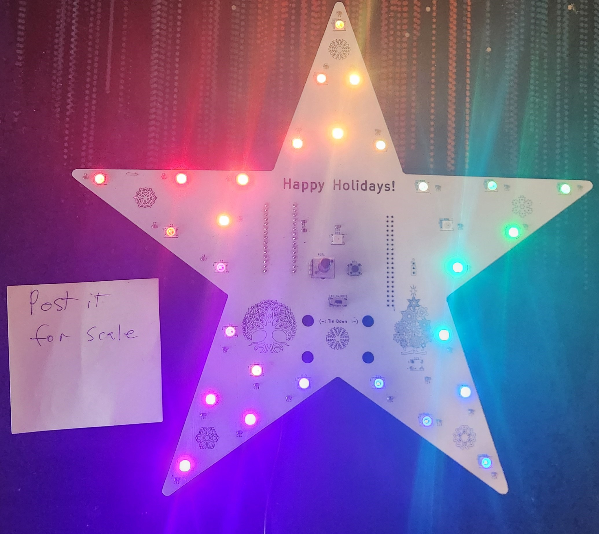
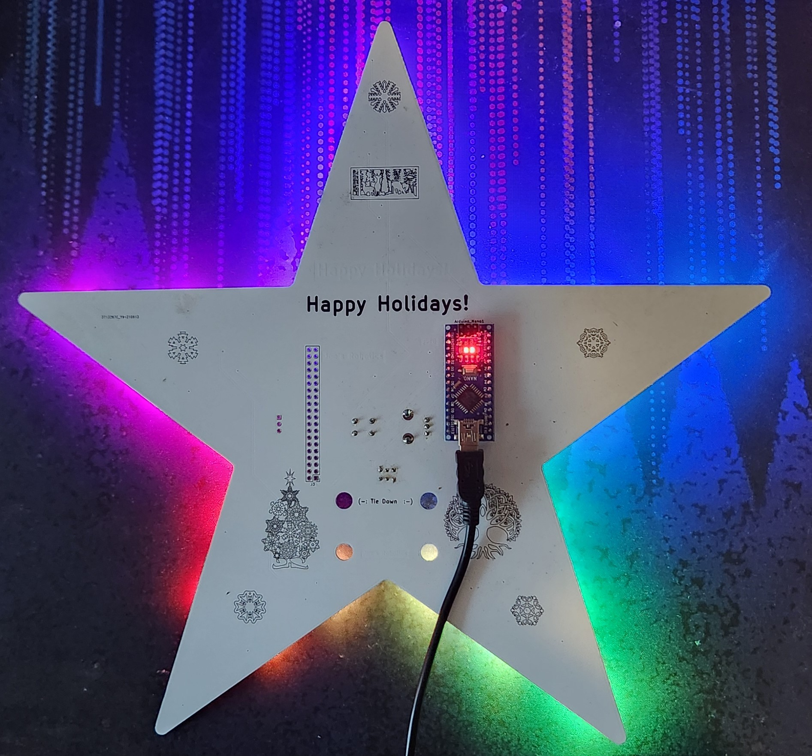

# Holiday_Star
Code for Joes robotics Holiday star, RGB LED 
 Utilizes fast_led lib. pin 2 =led, pin 3 = button, A0=pot

This code reads the mode button from the front of the star along with the potentiometer knob to set diffrent brightnesses, speeds, and modes.
Solid color selection, many rgb effects like fire, fade, twinkle fade, flash, tracer, pastel fade, and bright white. 

Arduino nano 

 

[]
https://github.com/JoesRobotics/Holiday_Star.git

LED_TYPE    WS2811
COLOR_ORDER GRB
NUM_LEDS    32
